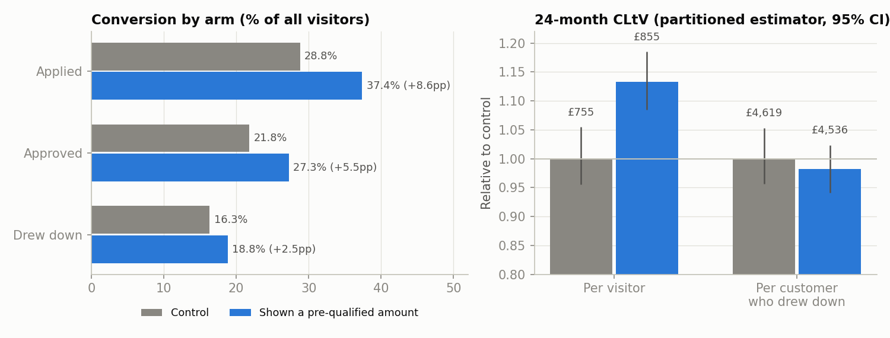
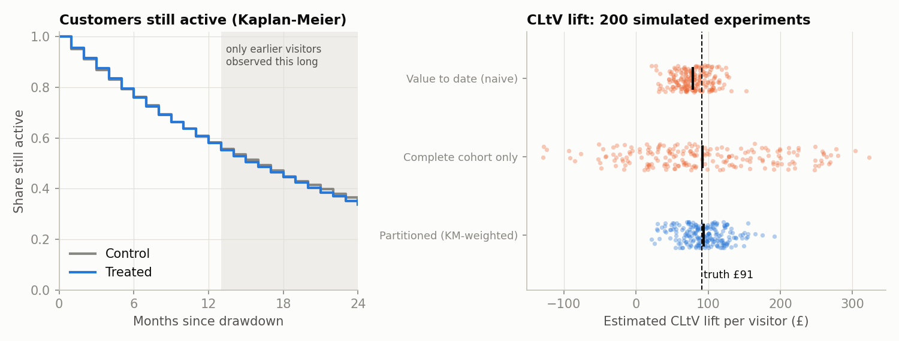
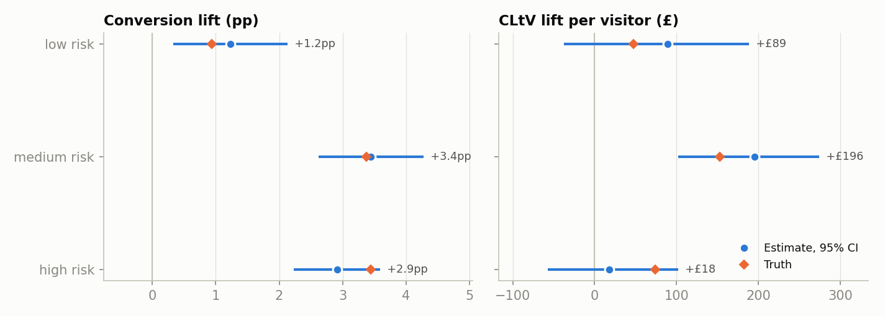
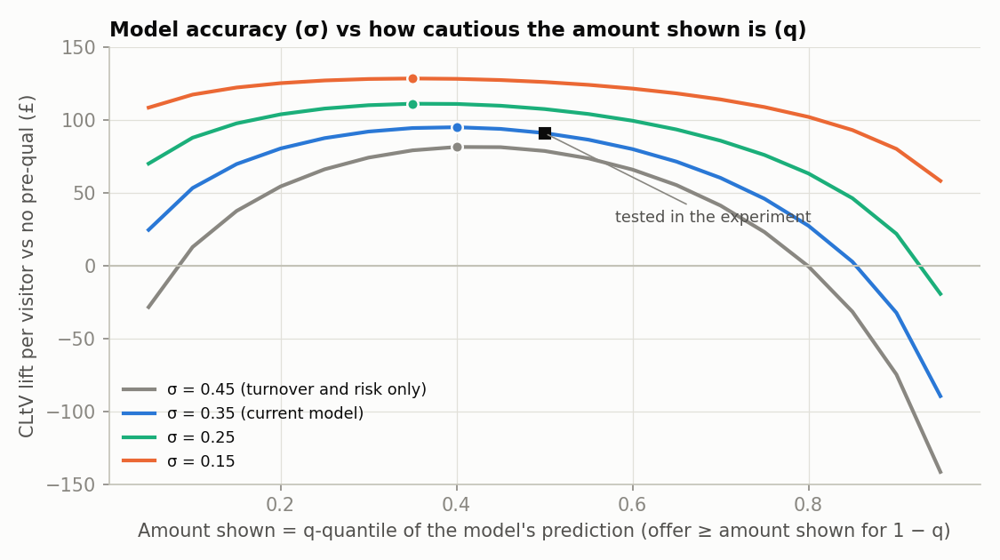

# Pre-qualification: does showing customers what they could borrow raise conversion and lifetime value, and how should the model behind it develop?

Suppose a lender starts showing small businesses an indicative amount before they apply ("you could borrow up to £X"). Two questions follow. **Did it work**, measured in conversion and in customer lifetime value (CLtV) rather than conversion alone? And **what should the next version of the pre-qualification model improve**: its accuracy, or how cautious the amount shown is?

> **Synthetic data, stated up front.** Real lending data is private, so the population and their behaviour are simulated with known true parameters (`src/simulate.py`). That is deliberate: every estimate can be checked against ground truth, and each method is scored over 200 simulated experiments rather than one convenient dataset. No claim here is about any real company's performance. Customer behaviour, margins, default rates and effect sizes are my assumptions.

## What it does

1. **A randomised experiment** (`src/simulate.py`, `src/funnel.py`): 100,000 visitors over 12 months, half shown a pre-qualified amount. Conversion is reported stage by stage, with Wilson intervals and Newcombe intervals for the differences.
2. **CLtV with incomplete follow-up** (`src/clv.py`): at the analysis date, visitors who arrived later have only been observed for 13 to 23 of the 24 months. Three estimators are compared: value observed so far, complete cohorts only, and a month-by-month **partitioned estimator** (Kaplan-Meier share still active × mean value earned that month; Lin et al., 1997). Confidence intervals come from a vectorised Poisson bootstrap.
3. **Who it works for**: lift in conversion and in CLtV by risk band.
4. **How the model should develop**: using the simulation's known behaviour, expected CLtV per visitor for each combination of model error (σ) and how cautious the amount shown is (q, the quantile of the model's prediction).

## How the simulated product works

Underwriting's final offer depends on turnover, risk and a residual the pre-qualification model only partly sees. The model's prediction has error σ = 0.35 on the log scale (σ = 0.45 would mean it knows only turnover and risk). In the experiment it shows its **median** prediction (q = 0.5), so the final offer meets or beats the amount shown for half of approved customers. In the data it was 49.7%, which is a useful calibration check to monitor in production.

Assumed behaviour: seeing an amount makes people more likely to apply, more so for riskier businesses (less sure they would qualify) and less so when the amount is well below what they need. An offer **below the amount shown** puts customers off drawing down. After drawdown, a customer earns a 1.5% monthly margin until they leave or default.

## Findings

### Conversion and CLtV both rise, but per-customer value falls



| | Control | Pre-qualified | Lift (95% CI) | True lift |
|---|---|---|---|---|
| Applied | 28.8% | 37.4% | +8.6pp (8.0 to 9.2) | |
| Drew down | 16.3% | 18.8% | **+2.5pp** (2.0 to 3.0) | +2.6pp |
| 24-month CLtV per visitor | £755 | £855 | **+£100** (44 to 152) | +£91 |
| 24-month CLtV per customer who drew down | £4,619 | £4,536 | −£84 (−387 to +157) | −£153 |

- Most of the extra applications do not become customers: applications rise by 30%, drawdowns by 15%.
- **CLtV per customer falls while CLtV per visitor rises.** The feature brings in extra, riskier customers who are worth less on average. Comparing customers who drew down across arms is a comparison of different groups of people (selection after treatment). The causal question is answered by **value per visitor**, the intent-to-treat comparison, which randomisation protects.

### Incomplete follow-up: value to date understates the effect



Over 200 simulated experiments (true lift £91 per visitor):

| Estimator | Bias | SD | RMSE |
|---|---|---|---|
| Value observed so far | **−£12.7 (−14%)** | £22.8 | £26.1 |
| Complete cohorts only | +£1.0 | £95.0 | £95.0 |
| Partitioned (KM-weighted) | +£2.4 | £30.4 | £30.5 |

- Value observed so far is biased by about **−14%**: it measures a mix of 13- to 24-month values, not 24-month CLtV. Its RMSE is slightly *lower* than the partitioned estimator's because truncated values are less noisy. But the bias scales with the effect and does not shrink with more data, so its confidence intervals centre on the wrong number.
- Using only fully observed cohorts is unbiased but throws away 92% of visitors, which more than triples the error.
- The partitioned estimator is close to unbiased and uses everyone. Its 95% bootstrap intervals covered the truth in **91.5%** of experiments, a little under nominal: the bootstrap understates the spread by about 5%. The conversion intervals covered it in 95%.

### Who it works for: conversion lift and value lift disagree



| Risk band | Conversion lift (true) | CLtV lift per visitor (true) | Control CLtV per customer (true) |
|---|---|---|---|
| Low | +1.2pp (+0.9pp) | +£89 (+£47) | £5,818 |
| Medium | +3.4pp (+3.4pp) | +£196 (+£153) | £4,487 |
| High | +2.9pp (+3.4pp) | +£18 (+£74) | £2,292 |

- In truth, medium- and high-risk visitors get the **same conversion lift (+3.4pp)**, but the value lift for high-risk visitors is half as large. Each extra high-risk customer is worth about half as much. Optimising for conversion alone would steer the feature toward the wrong customers.
- At this sample size, band-level CLtV intervals are wide (about ±£100), and the high-risk estimate (+£18) is £56 below its true value. Treat segment results as hypotheses for the next test, not as targeting rules.

### How the model should develop



Expected CLtV lift per visitor, from the simulation's known behaviour:

| Model error σ | Best q | Lift at best q | Lift at q = 0.5 | Lift at q = 0.9 |
|---|---|---|---|---|
| 0.45 (turnover and risk only) | 0.40 | £81 | £79 | −£75 |
| **0.35 (current)** | 0.40 | £95 | £91 | −£32 |
| 0.25 | 0.35 | £111 | £107 | +£22 |
| 0.15 | 0.35 | £128 | £126 | +£80 |

1. **Accuracy is the bigger lever.** Cutting model error from 0.35 to 0.25 is worth about £16 per visitor, and to 0.15 another £17. Moving the current model from its median to the best quantile is worth about £4.
2. **Over-promising is the expensive mistake.** Showing an optimistic amount (q = 0.9) turns a +£91 effect into −£32, because many customers then receive a lower offer than they were shown. Erring cautious costs far less.
3. **A better model can afford to be bolder.** As σ falls, the curve flattens, so the choice of q matters less.
4. These curves depend on the behaviour I assumed, especially how strongly a lower-than-shown offer puts people off. In practice that is the number to measure. A follow-up test that **randomises q** (say 0.3 vs 0.5) would estimate it directly, and the experiment's own data on offers below the amount shown is a start.

## Limitations

- Simulated data. Customer behaviour, margins, default rates and the shape of the response to the amount shown are my assumptions. Real data would add seasonality, repeat borrowing, top-ups and changes in the mix of applicants over time.
- CLtV is a 24-month contribution (margin minus credit losses), undiscounted, with no funding or acquisition costs. Longer horizons would need a parametric survival model to extrapolate beyond the observed follow-up.
- The partitioned estimator assumes follow-up length is unrelated to outcomes. A drift in customer quality across the enrolment window would break that.
- Underwriting is unchanged by the treatment. In reality, a changed applicant mix feeds back into the models trained on approved customers, a selection problem worth tracking as the pre-qualification model is retrained.
- Built with AI assistance (Claude). The code is checked against known answers in `tests/`, and every number above comes from `run_all.py`.

## Run it

```bash
pip install -r requirements.txt
python run_all.py          # about 1.5 minutes; regenerates figures/ and results/
python tests/test_core.py  # 6 checks against known answers
```

Developed with Python 3.11, numpy 2.2.6, pandas 3.0.2, scipy 1.13.1 and matplotlib 3.10.9.

## Layout

```
src/simulate.py     population, pre-qualification model, behaviour and true effects
src/funnel.py       conversion by arm, Wilson and Newcombe intervals
src/clv.py          CLtV under censoring: naive, complete-cohort, partitioned; Poisson bootstrap
src/style.py        plot style
run_all.py          single experiment, 200-experiment Monte Carlo, model-development grid, figures
tests/test_core.py  checks against known answers
results/            tables, JSON summary, run log
figures/            charts used above
```

Related repos: [`partner-funnel-analysis`](https://github.com/Max-Isse/partner-funnel-analysis) (funnel diagnosis, Bayesian partner estimates, sequential experiments), [`topup-causal-inference`](https://github.com/Max-Isse/topup-causal-inference) (measuring launches that were not randomised) and [`card-vs-loan-targeting`](https://github.com/Max-Isse/card-vs-loan-targeting) (which customers should see a credit card, a loan or both).
